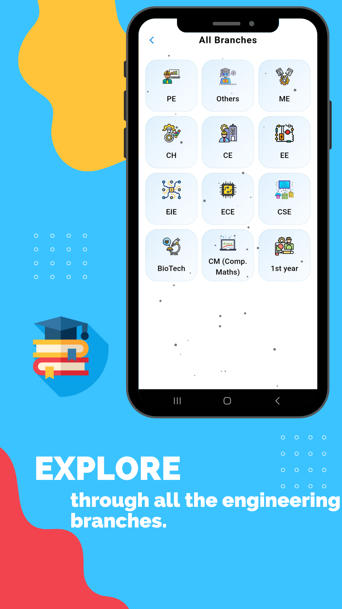

MADE WITH ❤️ IN 🇮🇳

# StudyBuddy 📚

**Your Ultimate Companion for College Examinations**

## Overview

Welcome to StudyBuddy, an open-source multi-platform app designed for downloading notes for your
semester exams of your college. It provides different features such as Filter, Category, Search,
Download and Contribute. You can contribute to it by uploading notes to it.

StudyBuddy is built using Flutter and Dart, leveraging Firestore for database management and
Firebase for authentication. This project employs Provider as its state management solution,
adhering to a clean architecture approach organized into multiple modules.

## Download App

## Screenshots

<table>
  <tr>
    <th width="32%">Splash Screen</th>
    <th width="32%">Login Screen</th>
    <th width="32%">Home Screen</th>
  </tr>
  <tr>
    <td></td>
    <td></td>
    <td></td>
  </tr>  
</table>

<table>
  <tr>
    <th width="32%">Engineering Branches</th>
    <th width="32%">Notes</th>
    <th width="32%">Youtube Topics</th>
  </tr>
  <tr>
    <td></td>
    <td></td>
    <td></td>
  </tr>  
</table>

<table>
  <tr>
    <th width="32%">Youtube Playlists</th>
    <th width="32%"></th>
    <th width="32%"></th>
  </tr>
  <tr>
    <td></td>
    <td></td>
    <td></td>
  </tr>  
</table>

## Features 🌟🌟

- **College Notes**: Get your study materials for your college examinations.
- **Download PDFs**: Easily download PDFs, and read it even in offline mode.
- **GATE Exam Preparation**: Prepare for the GATE examination, with provided study materials &
  youtube playlists.
- **Youtube Section**: Explore the youtube section for different area of interest like, Coding,
  Competitive Programming, DSA, App Development, Web Development, GATE, etc.
- **Profile Management**: Effortlessly create and manage profiles.

> **Note**: StudyBuddy is currently in active development 🚧, with plans to introduce additional
> features soon!

## Requirements ✅

 Click to expand 

 

**StudyBuddy** requires the following to function properly:

**Software:**

- **Flutter**: [Download Flutter](https://flutter.dev/docs/get-started/install) (version: 3.24 or
  higher)
- **Dart**: Installed as part of the Flutter SDK (version: 3.5 or higher)
- **Firebase**: A free Google service offering various backend functionalities. (
  See [Firebase documentation](https://firebase.google.com/docs) for setup instructions)

**Additional Requirements:**

- A **Google account** to create a Firebase project.
- An **active internet connection** for Firebase communication.

**Platform-Specific Requirements:**

- **Android (if targeting Android):**
    - An Android device or emulator for development and testing.
    - Android Studio (optional, but recommended) for
      development: [Download Android Studio](https://developer.android.com/studio)

- **iOS (if targeting iOS):**
    - A Mac computer with Xcode installed for development and testing.

**Optional (for development and testing):**

- **Firebase CLI**: Simplifies managing Firebase projects locally. (
  See [Firebase CLI documentation](https://firebase.google.com/docs/cli))

## Technologies Stack 📚

StudyBuddy leverages modern Flutter development technologies, adhering to industry best practices.
Below is our current technology stack:

- **MVVM Architecture**: A design pattern that separates the user interface from business logic,
  enhancing testability.
- **Flutter**: A UI toolkit for building natively compiled applications.
- **Dart**: The programming language used to write Flutter apps.
- **Http & Dio**: Libraries for making network requests.
- **Provider**: A state management solution that is simple and powerful.
- **Firebase Authentication**: For secure user authentication.
- **Firebase Firestore**: A scalable database for storing app data.
- **Cloud Functions**: To run backend code in response to events triggered by Firebase features.
- **Easy Pdf Viewer**: To view pdf files.

## Contribution 🤝

StudyBuddy is an open-source project, and we are currently accepting contributions. Also, we
appreciate community feedback and suggestions for future improvements.

## What's Coming Next? 🚀

- **Inbuilt Youtube Player**: StudyBuddy will soon support in-built youtube player feature, that
  helps users to watch videos in the app.
- **Offline Mode**: Study with your downloaded notes through StudyBuddy as we introduce offline mode
  in the app, making it easier to run the app even in offline mode.

## Feedback & Suggestions ✨

We welcome and appreciate any suggestions you may have for improvement. For bugs, questions, and
discussions, please use
the [GitHub Issues](https://github.com/Aman-Sirmaur19/StudyBuddy_App/issues).